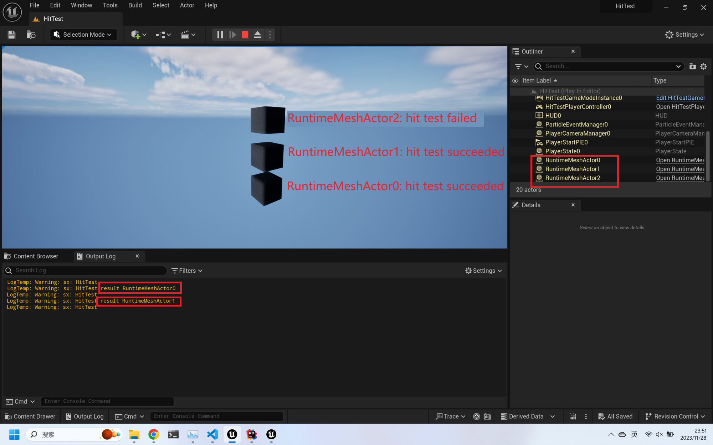

# Hit Test

To demonstrate the precision issue with hit tests on ProceduralMeshComponent, let's examine a project where three actors with ProceduralMeshComponent are spawned.

The first actor has a size of 100 and a scale of 1. The second actor has a size of 1 and a scale of 100. The third actor has a size of 0.005 and a scale of 20000.

```cpp
// HitTestGameMode.cpp 

ARuntimeMeshActor* Actor1 = GetWorld()->SpawnActor<ARuntimeMeshActor>(SpawnParams);
Actor1->CreateCube(100);
Actor1->SetActorLocationAndRotation(FVector(0.0f, 0.0f, -150.0f), FRotator(0.0f, 0.0f, 0.0f));
Actor1->SetActorScale3D(FVector(1, 1, 1));

ARuntimeMeshActor* Actor2 = GetWorld()->SpawnActor<ARuntimeMeshActor>(SpawnParams);
Actor2->CreateCube(1);
Actor2->SetActorLocationAndRotation(FVector(0.0f, 0.0f, 0.0f), FRotator(0.0f, 0.0f, 0.0f));
Actor2->SetActorScale3D(FVector(100, 100, 100));

ARuntimeMeshActor* Actor3 = GetWorld()->SpawnActor<ARuntimeMeshActor>(SpawnParams);
Actor3->CreateCube(0.005);
Actor3->SetActorLocationAndRotation(FVector(0.0f, 0.0f, 150.0f), FRotator(0.0f, 0.0f, 0.0f));
Actor3->SetActorScale3D(FVector(20000/**/, 20000, 20000));
```

The hit test is implemented in the `AHitTestPlayerController::HitTest()` function and triggered by a click event in the level blueprint

```cpp
void AHitTestPlayerController::HitTest(UWorld* world)
{
	FVector mousePos, mouseDir;
	DeprojectMousePositionToWorld(mousePos, mouseDir);
	float maxDist = 1.0e9;
	
	FHitResult hitResult;
	bool hit = world->LineTraceSingleByChannel(hitResult, mousePos, mousePos + mouseDir * maxDist, ECollisionChannel::ECC_Visibility); 
	AActor* hitActor = hitResult.GetActor();
	
	if (hit && hitActor != nullptr)
	{
		UE_LOG(LogTemp, Warning, TEXT("sx: HitTest result %s"), *hitActor->GetActorLabel());
	}
}
```

In the provided scenario, the first two cubes can be retrieved by clicking on them, but the third cube cannot.

